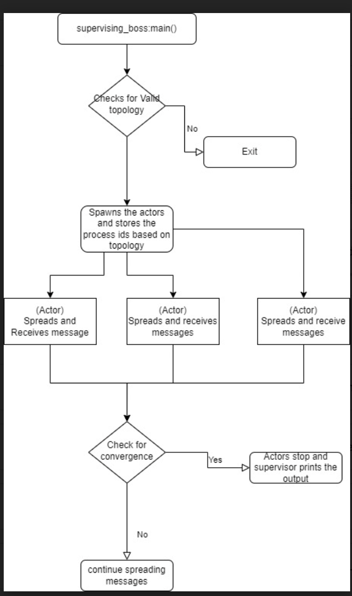

# GOSSIP-Simulation
Simulation of gossip algorithm in erlang

Use the following cmds to run project:
* chmod +x project2.sh
* ./project2.sh numNodes topology algorithm\
Where numNodes is the number of actors to spawn, topology is one of (full, line, twoD, imp2D), the algorithm is one of (gossip, pushsum).

What is working?

We were able to run all line, full, 2D, and Imp2D topologies in any combination with gossip and push-sum protocol. When all the nodes get converged, the convergence in gossip protocol is achieved.
A node is set to be converged when it listens to the message for the 10th time. When all the nodes are converged, the time taken to converge and convergence percentage is printed out.
In gossip protocol if the rumour has been spread 10 times to each node then the network gets stopped. 
In the case of push sum protocol if the difference of the three rounds of the results in each node is less than 0.0000000001 then the network gets stopped.

What is the largest network you managed to deal with for each type of topology and algorithm?

We decided to run with 10k actors because line topology taking long time to converge even though we could increase the capacity of other topologies.
We took a scale of 1000 actors.
The line topology is hard to achieve convergence.

Gossip:\
Full: 30000\
Line: 10000\
Imperfect2D: 10000\
2D:10000

Pushsum:\
Full : 10000\
Line: 10000\
Imperfect2D: 10000\
2D: 10000
